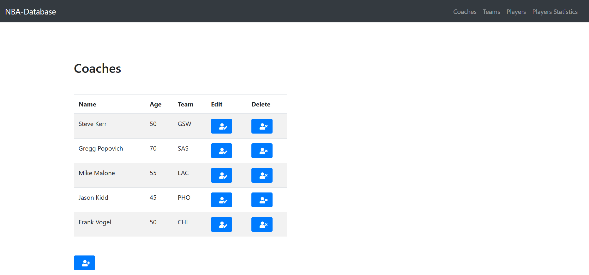
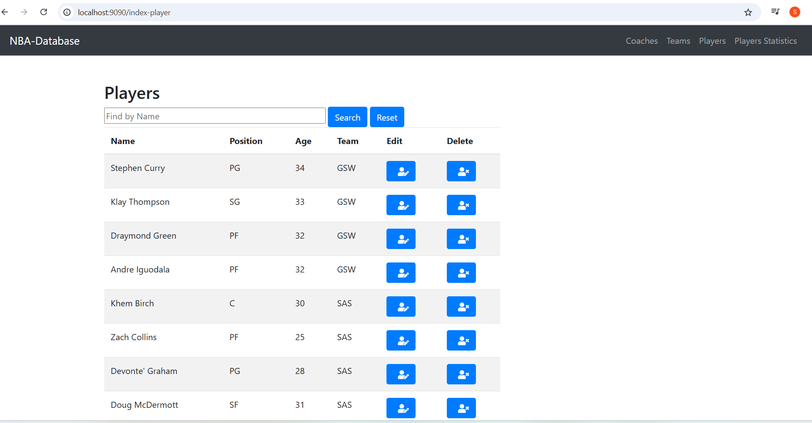
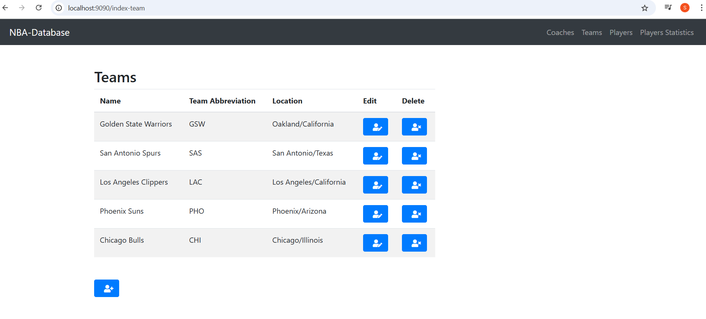

# NBA statistics


====
The idea of the project is to collect performance statistics among teams, coaches, and players.

The project has the following data model:


## Tech stack:
- Java 21
- Gradle
- Spring Boot
- Thymeleaf
- MySQL

## Instructions:

Steps how to start current service:

#### 1. Run nbs-statistics locally:
Go to \docker-local and run
```
run.bat|sh
```

#### 2. Link to start page is
```
 http://localhost:9090/index-player
```

#### 3. UI snippets are


